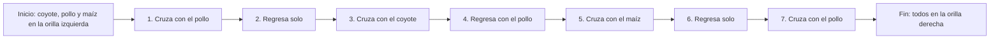

# Problema del campesino, el coyote, el pollo y el maíz

## Solución paso a paso
La idea es mover primero al **pollo**, porque es el elemento que no puede quedarse con ninguno de los otros dos.

### Secuencia correcta
1. El campesino lleva al **pollo** al otro lado.
2. El campesino regresa **solo**.
3. El campesino lleva al **coyote** al otro lado.
4. El campesino regresa con el **pollo**.
5. El campesino lleva el **maíz** al otro lado.
6. El campesino regresa **solo**.
7. El campesino lleva al **pollo** al otro lado.

## Explicación de por qué funciona
Después de mover al pollo primero, se evita que quede junto al coyote o al maíz sin vigilancia. Luego, cuando el coyote cruza, el pollo regresa para no dejar al coyote con él. Después se transporta el maíz, y al final se lleva otra vez al pollo.

Así, en ningún momento se rompe la regla del problema.

## Grafo de movimientos
Sí, también se puede representar como un grafo para ver la secuencia de estados.

## Tabla de movimientos
| Paso | Acción | Orilla izquierda | Orilla derecha |
|---|---|---|---|
| 1 | Lleva al pollo | coyote, maíz | campesino, pollo |
| 2 | Regresa solo | campesino, coyote, maíz | pollo |
| 3 | Lleva al coyote | maíz | campesino, coyote, pollo |
| 4 | Regresa con el pollo | campesino, pollo, maíz | coyote |
| 5 | Lleva el maíz | pollo | campesino, coyote, maíz |
| 6 | Regresa solo | campesino, pollo | coyote, maíz |
| 7 | Lleva al pollo |  | campesino, coyote, pollo, maíz |

La solución correcta requiere **7 movimientos** y garantiza que todos crucen el río sin problemas.
