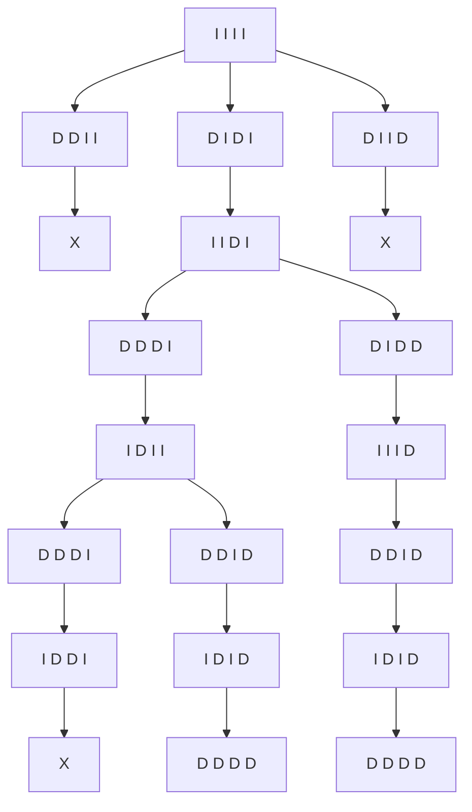
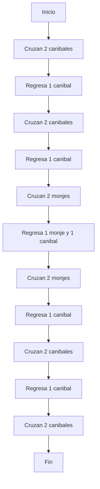

# IA
Es la ciencia e ingenio de hacer máquinas inteligentes, especialmente programas de cómputo inteligentes.

Búsqueda del estado requerido en el conjunto de los estados producidos por las acciones posibles.

# Problema del campesino, el coyote, el pollo y el maíz

## Arbol de movimientos

## Tabla de movimientos
| Paso |  Orilla izquierda | Acción | Orilla derecha |
|---|---|---|---|
| 1 |  coyote, maíz | Lleva al pollo | campesino, pollo |
| 2 |  campesino, coyote, maíz | Regresa solo | pollo |
| 3 |  maíz | Lleva al coyote | campesino, coyote, pollo |
| 4 | campesino, pollo, maíz | Regresa con el pollo | coyote | 
| 5 |  pollo | Lleva el maíz | campesino, coyote, maíz |
| 6 |  campesino, pollo | Regresa solo | coyote, maíz |
| 7 |   | Lleva al pollo | campesino, coyote, pollo, maíz |

La solución correcta requiere **7 movimientos** y garantiza que todos crucen el río sin problemas.

---

# Problema de los tres caníbales y tres monjes

## Arbol de movimientos

## Tabla de movimientos
| Paso | Orilla izquierda | Acción | Orilla derecha |
|---|---|---|---|
| 1 |  3 monjes, 1 caníbal | Cruzan 2 caníbales | 2 caníbales |
| 2 |  3 monjes, 2 caníbales | Regresa 1 caníbal | 1 caníbal |
| 3 |  3 monjes | Cruzan 2 caníbales | 3 caníbales |
| 4 |  3 monjes, 1 caníbal | Regresa 1 caníbal | 2 caníbales |
| 5 |  1 monje, 1 caníbal | Cruzan 2 monjes | 2 monjes, 2 caníbales |
| 6 |  2 monjes, 2 caníbales | Regresa 1 monje y 1 caníbal | 1 monje, 1 caníbal |
| 7 |  2 caníbales | Cruzan 2 monjes | 3 monjes, 1 caníbal |
| 8 |  3 caníbales | Regresa 1 caníbal | 3 monjes |
| 9 | 1 caníbal | Cruzan 2 caníbales | 3 monjes, 2 caníbales |
| 10 |  2 caníbales | Regresa 1 caníbal | 3 monjes, 1 caníbal |
| 11 |   | Cruzan 2 caníbales | 3 monjes, 3 caníbales |

La solución correcta requiere **11 movimientos**.

